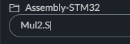
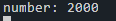

# Using Assembly

# Contents

- [Using Assembly](#using-assembly)
- [Contents](#contents)
- [Introduction](#introduction)
- [Setup](#setup)
  - [Creating an Assembly File](#creating-an-assembly-file)
  - [Writing Assembly](#writing-assembly)
  - [Calling Assembly from C++](#calling-assembly-from-c)
- [Debugging](#debugging)

# Introduction

This an example of how to use [ARM Assembly](https://developer.arm.com/documentation/dui0473/m/writing-arm-assembly-language) on an STM32L4R5ZI board using [Keil Cloud Studio](https://studio.keil.arm.com/). Being able to run some small assembly code on a microcontroller is useful for a number of reasons:

- It can be used to optimize critical sections of code
- Allows access to parts of hardware inaccessible from C

This project will contain a number of examples, these include:

- Passing a number to assembly and returning the number multiplied by 2

# Setup

To get started create a new project or import this one into Keil Cloud Studio by following the guide [here](https://github.com/QUB-ARM-STM32/User-Guide/tree/master/KeilStudioCloud#importing-a-project).

## Creating an Assembly File

TO start writing assembly we will first need to create a new file. To do this right click on your projects name in the `Project Explorer` and select `New File`. Enter `Mul2.S` **(S must be capitalized)** as the name and click `OK`.



## Writing Assembly

Before we start writing our program we have to set up the file correctly. We will define an `AREA`. An `AREA` is just a section of assembly code. We will define a `CODE` area and a `DATA` area within is. TO define an `AREA` we use the following syntax:

```ARM
    AREA Mul2_func, CODE
    EXPORT Mul2
Mul2
    ; Code goes here
    AREA my_data, DATA
    ; Data goes here
    END
```

In the above example we create an `AREA` called `Mul2_func`, we then `EXPORT` `Mul2`. This means we are making our label `Mul2` global allowing it to be called from C++. **The Name of the `AREA` and the `EXPORT` label must be different**. Finally we can set up our `DATA` area.

Next we will store a constant value in our data section. To do this we can use the instruction `DCW` (Define Constant Word). This instruction takes a word (4 bytes) and stores it in memory. We will simply store the number `1`.

```ARM
    AREA Mul2_func, CODE
    EXPORT Mul2
Mul2
    ; Code goes here
    AREA my_data, DATA
my_const
    DCW 1
    END
```

Next we can load this value into a register:

```ARM
    AREA Mul2_func, CODE
    EXPORT Mul2
Mul2
    LDR R1, =my_const
    LDR R1, [R1]
    AREA my_data, DATA
my_const
    DCW 1
    END
```

As we want to pass data into our assembly from C++ we will need to refer to the ARM docs. In these it states:


This means if we pass in one parameter it will be passed in through `R0`.

The docs also states how to return a value:


This means if move the result of our arithmetic into `R0` it will be returned to C++.

Now we can do the our multiplication as we are simply multiplying by 2 we can do a logical shift left.

```ARM
    AREA Mul2_func, CODE
    EXPORT Mul2
Mul2
    LDR R1, =my_const
    LDR R1, [R1]
    LSL R0, R0, R1
    BX LR
    AREA my_data, DATA
my_const
    DCW 1
    END
```

## Calling Assembly from C++

Now we have written our assembly we need to call it from C++. To do this we will create a function prototype in our `main.cpp` file. Ensure to place it before the `main` function.

```cpp
extern "C" int Mul2(int num);
```

This tells the compiler that the function `Mul2` is defined elsewhere. Next we can call the function from `main`:

```cpp
// define the number
int num = 1000;

// call the assembly
num = Mul2(num);

// printf the result
printf("number: %d\r\n", num);
```

Now we can build and run the code. [Open the serial monitor](https://github.com/QUB-ARM-STM32/Serial-Output#opening-the-serial-monitor) and you should see the following:



As you can see the number has been multiplied by 2.

# Debugging

The debugging capabilities of Keil Cloud Studio are quite limited as already seen. There is no way to step through assembly code like you can in [STM32CubeIDE](https://github.com/QUB-ARM-STM32/User-Guide/tree/master/STM32CubeIDE/Projects/Assembly). This can make it very difficult to debug assembly code of any sort of length. The only way to debug the assembly is to pass certain values into registers during the program and after the assembly has been run check these registers.

If you want more advanced debugging capabilities you will have to use [STM32CubeIDE](https://github.com/QUB-ARM-STM32/User-Guide/tree/master/STM32CubeIDE/).
